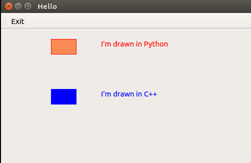

hello-sip-pyqt5
======

An example of building a Qt-based GUI app with both Python and C++ interfaces of Qt (PyQt5 and Qt5).
The connection between C++ and Python is based on the SIP tool which is used to make Python bindings for C/C++ code.

The central widget of the GUI is a QPainter surface to be drawn on, and this QPainter surface is drawn by both 
Python code and C++ code.

GUI
------


Dependencies
------
1. Qt5 v5.9.1: https://www.qt.io/download/
2. SIP 4.19.3: https://www.riverbankcomputing.com/software/sip/download
3. PyQt5 v5.9: https://www.riverbankcomputing.com/software/pyqt/download5
4. Python 3 (python3)

Quick start
------

```bash
$ git clone git@github.com:zanton/hello-sip-pyqt5.git
$ cd hello-sip-pyqt5
$ make
$ python3 runme.py
```

Quick troubleshootings
------

- Ensure PyQt5 modules are included in system's Python path, e.g.,
  ```bash
  $ export PYTHONPATH=/opt/local/lib/python3.5/dist-packages:$PYTHONPATH
  ```

- src/hello.pro: ensure Qt5's include directory is included in system's include path,
  otherwise add it to INCLUDEPATH variable in src/hello.pro, e.g.,
  ```bash
  INCLUDEPATH += /opt/Qt5.9.1/5.9.1/gcc_64/include
  ```

- sip/configure.py: ensure PyQt5's SIP include directory and Qt5's include directory are included in system's include path,
  otherwise change to correct paths in sip/configure.py, e.g.,
  ```bash
  sip_inc_dir = "/opt/local/share/sip/PyQt5"
  qt_inc_dir = "/opt/Qt5.9.1/5.9.1/gcc_64/include"
  ```

More details
------

1. Qt5 installation:

- installation directory 

```bash
/home/zanton/local/Qt5.9.1
```

- src/hello.pro

```python
INCLUDEPATH += /home/zanton/local/Qt5.9.1/5.9.1/gcc_64/include
```

2. SIP installation:

```bash
$ cd sip-4.19.3
$ python3 configure.py --sysroot=/home/zanton/local --configuration myconfig.txt
$ make
$ make install
```

- myconfig.txt

```python
# The target Python installation.
py_platform = linux
py_inc_dir = /usr/include/python%(py_major).%(py_minor)

# Where SIP will be installed.
sip_bin_dir = %(sysroot)/bin
sip_inc_dir = %(sysroot)/include
sip_module_dir = %(sysroot)/lib/python%(py_major)/dist-packages
sip_sip_dir = %(sysroot)/share/sip
```

3. PyQt5 installation:

```bash
$ cd PyQt5_gpl-5.9
$ python3 configure.py --sysroot=/home/zanton/local
$ make
$ make install
```
